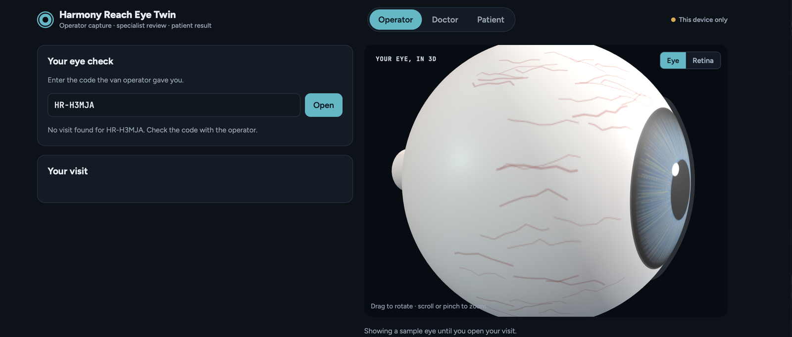

# Harmony Reach — Eye Twin Simulator

A working prototype of a mobile eye-screening service with three connected roles: an **operator** in a screening van takes an eye photo, a **doctor** reviews a 3D digital twin of that eye remotely, and the **patient** follows their result with a visit code.

Built as part of the Topcon Healthcare case in the Product Development course at the University of Oulu (2026). It shows the "digital twin at the doctor's side" idea from our service concept as something people can actually click through.

> **Concept prototype, not a medical device.** The 3D eye is a visual model built from a photo. It does not measure or diagnose anything. Harmony Reach is a student concept and not an official Topcon product.

**Live demo:** icberg.github.io/harmony-reach-eye-twin/?v=2#operator

Jump straight to a role: [Operator](https://icberg.github.io/harmony-reach-eye-twin/#operator) · [Doctor](https://icberg.github.io/harmony-reach-eye-twin/#doctor) · [Patient](https://icberg.github.io/harmony-reach-eye-twin/#patient)



### Try it in two minutes

1. **Operator:** fill in the intake form, tap **Use sample eye** (or take/upload a photo) and press **Send visit to specialist**. Note the visit code, e.g. `HR-4K7QD`.
2. **Doctor:** open the visit from the queue, rotate the 3D eye, switch to **Retina**, then set Green / Amber / Red and **Send result to patient**.
3. **Patient:** enter the visit code and press **Open** to see the timeline, the result and your own 3D eye.

Stay in the same browser tab the whole time. On GitHub Pages, visits live only in that open page, so a reload clears them (see [Two ways it runs](#two-ways-it-runs)).

## The flow

| Role | What they do |
|---|---|
| **Operator** (van driver trained as operator) | Fills in a short intake form → takes or uploads an eye photo → taps the pupil, or lets the page auto-centre it → checks image quality → optionally adds a fundus (retina) photo → sends. Gets a visit code like `HR-4K7QD`. |
| **Doctor** (remote specialist) | Sees a queue sorted urgent → waiting → reviewed. Opens a visit and rotates a 3D eye whose iris is the patient's real photo. Switches to a 3D retina view. Compares with the patient's earlier visits. Sets Green / Amber / Red with a note. |
| **Patient** | Enters the visit code and sees a timeline (captured → in review → result), a plain-language result, and their own 3D eye. |

## Features

- **3D eye twin (Three.js):** sclera sphere with a generated vein texture, an iris cap textured from the cropped photo, a transparent cornea and an optic-nerve stub. Orbit, zoom and auto-rotate.
- **3D retina view:** the fundus photo's brightness becomes a height map on a 160 × 160 mesh, with a foveal pit. If there's no fundus photo, a generated one is used.
- **Image-quality check in the browser:** sharpness (Laplacian variance), brightness, glare and how well the eye is centred, all calculated from canvas pixels, so the photo never has to leave the device for this step.
- **Pupil finding:** tap or drag to place the iris ring, a slider for its size, or auto-centre on the darkest region.
- **Sample data:** a "Sample eye" generator and an "Add a sample visit" button, so you can demo without real photos.
- **Role tabs:** Operator, Doctor and Patient switch instantly within one page, and the URL follows along (`#operator`, `#doctor`, `#patient`), so you can share a link straight to one role.
- Light and dark theme, responsive down to phone width.

## Two ways it runs

The page has a small data layer that picks a backend when it starts:

| Mode | Where | What works |
|---|---|---|
| **Single device** | Any browser (GitHub Pages, opening the file locally) | Everything, inside one open page. Switch roles with the tabs at the top. Data is kept in memory and cleared on reload, so a visit code from another device or an earlier session shows "No visit found". |
| **Live sync** | Published as a Claude artifact on claude.ai | A shared real-time database (the operator's phone and the doctor's laptop update live), stored photos, and an optional AI photo-quality check (Claude, asked only about photo quality, never for a diagnosis). |

## Run it

No build step and no dependencies to install. It's a single HTML file.

```bash
git clone https://github.com/icberg/harmony-reach-eye-twin.git
cd harmony-reach-eye-twin
open index.html          # or double-click it
```

You need to be online, because Three.js r128 loads from cdnjs and jsDelivr.

The live demo is served by GitHub Pages from the `main` branch root (Settings → Pages → Deploy from branch).

## Tech

- HTML, CSS and vanilla JavaScript in one file
- Three.js r128 + OrbitControls
- Canvas 2D for image analysis and texture generation
- Figtree + JetBrains Mono (Google Fonts)
- Claude artifact runtime (`db`, `assets`, `sample`), optional, for live sync

## Data model

One document per visit (`visits/<code>`):

```text
code, createdAt, patientName, patientKey, age, diabetes, visionLoss, eye,
status: urgent | waiting | reviewed,
iqa:   { score, focus, light, centred, glare, ai },
iris:  { cx, cy, r },  irisData, thumbData,  fundusData | fundusId,
triage:{ level: green | amber | red, note, at }
```

## Limits

- No live camera stream. The page uses the browser's photo picker, which opens the camera on phones.
- The twin is a visual model, not a measurement. A real version would build it from OCT scans (for example from a Topcon Maestro2).
- There are no accounts or access control. **Don't use real patient data.**

## Changelog

- **2026-10-04:** Fixed the role tabs. All three views were showing stacked on one page because a layout style overrode the `hidden` attribute. Switching tabs now shows one role at a time, scrolls to the top, and follows `#role` links. Added a screenshot and a quick-start walkthrough.
- **2026-10-03:** First release on GitHub Pages.

## Context

Part of a team service design for Topcon Healthcare: mobile screening vans run by trained drivers, edge AI image-quality checks, a remote specialist portal, and sales to governments for mandatory screening programmes. This prototype covers the operator → doctor → patient part of that service.

Built by Fahim Murshed with Claude Code.
